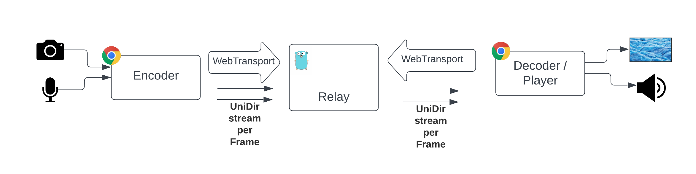

# go-media-webtransport-server
This is an experimental media server that uses WebTransport. It can be used in conjunction with following live encoder and player [webcodecs-capture-play](https://github.com/facebookexperimental/webcodecs-capture-play). Both repos allows us create a live streaming platform where we can control the knob latency vs quality 

Lowest end to end latency archived under perfect network conditions <60ms)

Important notes:
- This server does NOT implement any de-jitter, we considered more optimal only de-jitter on the final consumer (player)
- This server is able to deliver a frame before finishing to write it to minimize latency (AKA: read while write)


Fig1: Main block diagram

# Packager
See media packager information in this [link](https://github.com/facebookexperimental/webcodecs-capture-play#packager)

# Cache key
The unique frame key used to identify a frame object is:
```
streamID/mediaType/SeqId (example: abc1234/video/34)
```
- streamID: Unique identifier for the stream
- mediaType: Unique identifier for tracks inside the stream (only supported "video" and "audio" for now)
- seqID: Monotonically increasing identifier for every frame inside each mediaType

# Server processes
This server (relay) does media ingest and delivery. It does NOT transcode


Fig3: Server processes

## Ingest process
- This server accepts WebTransport sessions for **ingest** in the following entry point:
```
https://[HOST]:4433/moqingest/[streamID]
```
- The encoder creates a unidirectional QUIC stream per each audio frame (every ~20ms for 48KHz) and for each video frame (every ~33ms for 30fps) and sends them to the server (only 1 audio 1 video supported for now)
- The server stores every frame object in memory identified by its cache key
    - It allows read (deliver) before the frame is fully written
- **Housekeeping**: The server periodically checks frame objects expiration times and removes all the expired ones

## Delivery process
- This server accepts WebTransport sessions for **delivery** in the following entry point:
```
https://[HOST]:4433/moqdelivery/[streamID]?old_ms=X&vj_ms=V&aj_ms=A[,sa=S][,ea=E]
```
- `old_ms`: Time in ms from live edge (0 = live edge)
- `vj_ms`: Player video jitter buffer size in ms
- `aj_ms`: Player audio jitter buffer size in ms
- `sa`: Time for the highlight to start in EPOCH ms
- `ea`: Time for the highlight to end in EPOCH ms

- Depending on the QS params the server selects the session delivery type:
    - If (`sa` > 0 && `ea` > 0) -> VOD/Highlight
    - else If (`old_ms` > 0) -> Rewind
    - else: Live edge (so `old_ms` == 0)

See more about playback session types in [playback session types](https://github.com/facebookexperimental/go-media-webtransport-server#playback-session-types)
- Playback session decides what frame to push and when
- When it is time to push a new frame it opens a new QUIC unidirectional (server -> Player) stream and sends it.
- As a protection the server kills the playback WebTransport session if there is any unexpected error OR the number of inflight streams is too high

# Playback session types

## Live edge
It pushes frames to the player as soon as possible. So this could create gaps in the player if frame N+1 arrives before N and playback jitter buffer is NOT enough to reorder that.

This is a session type that values latency over quality


Fig4: Live edge playback session

- After transport is established
- Reads playback session data: `streamID`,`old_ms`,`vj_ms`,`aj_ms`,`sa`,`ea`
- Sends audio init segment
- Sends video init segment
- **Selects live edge** session delivery type (`sa`, `ea` not present or 0, and `old_ms` == 0)
    - Creates `deliverySession` to track this session
    - Start loop
        - Finds last (biggest) seqId for audio that accomplishes:
            - Received after playback session stated
            - Received inside the window, between (now - jitterBuffer) AND (now)
            - Not sent yet
        - If found audio frame -> send it and goto loop. If no more audio segments to send continue to video
        - Finds last (biggest) seqId for video that accomplishes:
            - Received after playback session stated
            - Received inside the window, between (now - jitterBuffer) AND (now)
            - Not sent yet
        - If found video frame -> send it
        - If nothing has been sent -> `Sleep(5ms)`
        - Goto loop

## Rewind
The servers emulates a live session from Xms ago, in this case live head is set to now - rewind time.

This is a session type that (in general) values quality over latency


Fig4: Live rewind playback session first loop


Fig5: Live rewind playback session after first loop

- After transport is established
- Reads playback session data: `streamID`,`old_ms`,`vj_ms`,`aj_ms`,`sa`,`ea`
- Sends audio init segment
- Sends video init segment
- **Selects live rewind** session (`sa`, `ea` not present or 0, and `old_ms` > 0)
    - Creates `deliverySession` to track this session
    - Start loop
        - First loop
            - Finds the biggest seqId received before now - rewind OR 1st seqId received if rewind > live length
            - Set `clkStart` to the time that frame was captured (encoder sends this data)
        - NOT first loop
            - Finds the lowest audio seqId inside delivery window that is NOT sent yet
            - If found audio frame -> send it and goto loop. If no more audio segments to send continue to video
            - Finds the lowest video seqId inside delivery window that is NOT sent yet
            - If found video frame -> send it 
        - If nothing has been sent -> `Sleep(5ms)`
        - Goto loop

## Highlights / VOD
The servers emulates a live session from Xms ago and stops and end time (AKA: Highlights). In this case live head is set to now - rewind time, and we stop serving data when we reach end time.

This is a session type that (in general) values quality over latency


Fig6: Live vod start


Fig7: Live vod end

- After transport is established
- Reads playback session data: `streamID`,`old_ms`,`vj_ms`,`aj_ms`,`sa`,`ea`
- Sends audio init segment
- Sends video init segment
- **Selects VOD** session (`sa`, `ea` are present and > 0)
    - Creates `deliverySession` to track this session
    - Start loop
        - First loop
            - Finds the biggest seqId received before now - rewind OR 1st seqId received if rewind > live length
            - Set `clkStart` to the time that frame was captured (encoder sends this data)
        - NOT first loop
            - Finds the lowest audio seqId inside delivery window that is NOT sent yet
            - If found audio frame -> send it and goto loop. If no more audio segments to send continue to video
            - Finds the lowest video seqId inside delivery window that is NOT sent yet
            - If found video frame -> send it 
        - If nothing has been sent -> `Sleep(5ms)`
        - Goto loop

# Installation 
To install this server in a EC2 Amazon linux instance follow the next steps:
- Launch en EC2 instance

- Configure security group ports
    - Inbound
        - SSH: 22 TCP (From: [up to you])
        - WT: 4433 UDP (From: everywhere IPv4 and IPv6)
        - HTTPs: 443 (From: everywhere IPv4 and IPv6)
        - HTTPs: 80 [Optional, just testing] (From: everywhere IPv4 and IPv6)
    - Outbound
        - ALL

- Update server
```
sudo yum update -y
```

- Install dependencies 
```
sudo yum install git tmux -y
```

- Install go (version go1.18.9 or higher)
```
sudo yum install golang -y
```

- Install and activate a webServer 
```
sudo yum install -y httpd
sudo systemctl start httpd
sudo systemctl enable httpd
sudo yum install mod_ssl -y
```
- Configure certificates (needed for WebTransport)
    - You can use any process you want to install valid signed certificates. We used [LetEncrypt](https://certbot.eff.org/instructions?ws=apache&os=centosrhel8), but we needed to modify the instructions quite a bit to make it work in Amazon Linux
```
sudo amazon-linux-extras install epel -y
sudo yum install certbot -y
sudo yum install python2-certbot-apache -y
```
 
- Configure Apache
    - Edit the main Apache configuration file `/etc/httpd/conf/httpd.conf`. Locate the "Listen 80" and add the following lines after it, replacing the example domain names.
```
<VirtualHost *:80>
    DocumentRoot "/var/www/html"
    ServerName "yourdomain.com"
    ServerAlias "subdomain.yourdomain.com"
</VirtualHost>
```

- Configure certificates
    - In this stage stage you will need to show that you own the domain you are trying to configure (You will need to answer some questions)
```
sudo certbot --apache
```
- Clone this repo
```
git clone git@github.com:facebookexperimental/go-media-webtransport-server.git
```

- Compile it
```
cd go-media-webtransport-server/src
go build
```

- Copy previously generated certs to allow this server to use them(careful with renewals, they will NOT work)
```
cd ..
mkdir certs
sudo cp /etc/letsencrypt/live/[YOUR_DOMAIN]/privkey.pem certs/certificate.key
sudo chmod 644 certs/certificate.key
sudo cp /etc/letsencrypt/live/[YOUR_DOMAIN]/cert.pem certs/certificate.pem
```

- Start server inside tmux
```
tmux
cd src
./go-media-webtransport-server
```

Note: To test the code in your computer and Chrome you can use the script `scripts/start-chrome.sh` that allows you to use WebTransport in your localhost (not safe environment)

# TODO
- Start at IDR, now player discards before IDR
- Do not wait for 5ms, wake up when it is time to send next
- Characterize protocol behavior in front of network defects
    - Packet loss / limited BW
    - Delay
    - High jitter

EXPERIMENT! :-)

# License
go-media-webtransport-server is released under the [MIT License](https://github.com/facebookincubator/rush/blob/master/LICENSE).