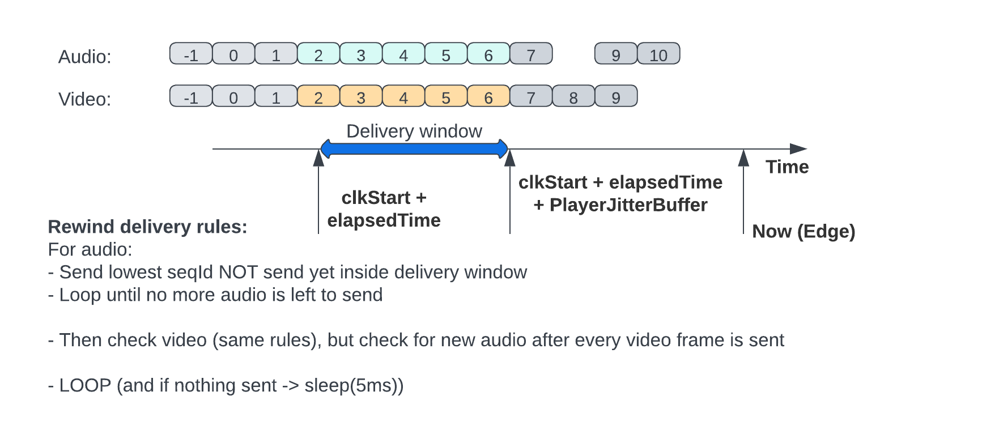
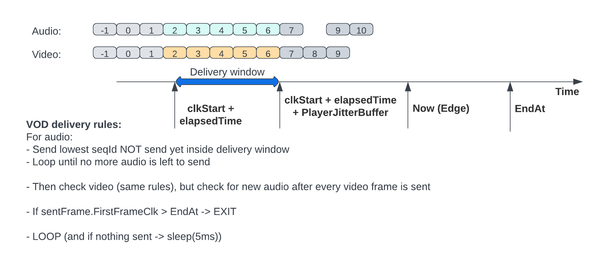

# go-media-webtransport-server

This is an experimental media server that uses WebTransport. It can be used in conjunction with following live encoder and player [webcodecs-capture-play](https://github.com/facebookexperimental/webcodecs-capture-play). That combination allows to create a live streaming platform where we can control the knob latency vs quality (lowest end to end latency archived under perfect network conditions <60ms)

Important notes:
- This server does NOT implement any de jitter, we considered more optimal only de jitter on the final recipient of data (player)
- This is able to deliver a frame before we finished writing it to minimize latency (read while write)


Fig1: Main block diagram

# Packager
We use a very experimental, flexible, and NON optimal packager that it was created for specifically for this, see fig2

This server ONLY accesses to the data in the frame HEADER 


Fig2: Media packager

# Cache key
The unique frame key used to identify a frame is:
```
streamID/mediaType/SeqId
```
- streamID: Unique identifier for all the stream
- mediaType: Unique identifier for tracks inside the stream (only supported "video" and "audio" for now)
- seqID: Monotonically increasing identifier for every frame inside each mediaType

# Server processes
This server (relay) does media ingest and delivery. It does NOT transcode


Fig3: Server processes

## Ingest process
- This server accepts WebTransport sessions for **ingest** in the following entry point:
```
https://[HOST]:4433/moqingest[streamID]
```
- The encoder creates unidirectional QUIC streams per audio and video frames and send it to the server (only 1 audio 1 video supported for now)
- The server stores every frame in memory identified by its cache key
    - It allows read (deliver) before the frame is fully written
- **Housekeeping**: The server periodically checks frame expiration times and removes all the expired ones

## Delivery process
- This server accepts WebTransport sessions for **delivery** in the following entry point:
```
https://[HOST]:4433/moqdelivery/[streamID]?old_ms=X&vj_ms=V&aj_ms=A[,sa=S][,ea=E]
```
- `old_ms`: Time in ms from live edge
- `vj_ms`: Player video jitter buffer size in ms
- `aj_ms`: Player audio jitter buffer size in ms
- `sa`: Time for the highlight to start in EPOCH ms
- `ea`: Time for the highlight to end in EPOCH ms

- Depending on the QS params it choses the session delivery type:
    - If (`sa` > 0 && `ea` > 0) -> VOD/Highlight
    - else If (`old_ms` > 0): Rewind
    - else: Live edge (so `old_ms` == 0)

See more about session types in [playback session types](TODO)
- Playback session decides what frame to push and when
- When is time to push a new frame it opens a new QUIC unidirectional (server -> Player) stream and sends it.
- As a protection the server kills the playback WebTransport session if there is any unexpected error OR the number of inflight streams is too high

# Playback session types

## Live edge
It pushes frames to the player as soon as possible. So this could create gaps in the player if frame N+1 arrives before N and playback jitter buffer is NOT enough to reorder that.

This is a session type that values latency over quality


Fig4: Live edge playback session

- After transport is established
- Reads playback session data: `streamID`,`old_ms`,`vj_ms`,`aj_ms`,`sa`,`ea`
- Sends audio init segment
- Sends video init segment
- **Selects live edge** session if `sa`, `ea` not present or 0, and `old_ms` == 0
    - Creates `deliverySession` to track this session
    - Start loop
        - Finds last (biggest) seqId for audio that accomplishes:
            - Received after playback session stated
            - Received inside the window (now - jitterBuffer AND now)
            - Not sent yet
        - If found audio frame -> send it and goto loop. If no more audio segments to send continue to video
        - Finds last (biggest) seqId for video that accomplishes:
            - Received after playback session stated
            - Received inside the window (now - jitterBuffer AND now)
            - Not sent yet
        - If found video frame -> send it
        - If nothing has been sent -> `Sleep(5ms)`
        - Goto loop

## Rewind
The servers emulates a live session from Xms ago, in this case live head is set to now - rewind time.

This is a session type that (in general) values quality over latency


Fig4: Live rewind playback session first loop


Fig5: Live rewind playback session after first loop

- After transport is established
- Reads playback session data: `streamID`,`old_ms`,`vj_ms`,`aj_ms`,`sa`,`ea`
- Sends audio init segment
- Sends video init segment
- **Selects live rewind** session if `sa`, `ea` not present or 0, and `old_ms` > 0
    - Creates `deliverySession` to track this session
    - Start loop
        - First loop
            - Finds the biggest seqId received before now - rewind OR 1st seqId received if rewind > live length
            - Set `clkStart` to the time that frame was captured (encoder sends this data)
        - NOT first loop
            - Finds the lowest audio seqId inside delivery window that is NOT sent yet
            - If found audio frame -> send it and goto loop. If no more audio segments to send continue to video
            - Finds the lowest video seqId inside delivery window that is NOT sent yet
            - If found video frame -> send it 
        - If nothing has been sent -> `Sleep(5ms)`
        - Goto loop

## Highlights / VOD
The servers emulates a live session from Xms ago and stops and end time (AKA: Highlights). In this case live head is set to now - rewind time, and we stop serving data when we reach end time.

This is a session type that (in general) values quality over latency


Fig6: Live vod start


Fig7: Live vod end

- After transport is established
- Reads playback session data: `streamID`,`old_ms`,`vj_ms`,`aj_ms`,`sa`,`ea`
- Sends audio init segment
- Sends video init segment
- **Selects VOD** session if `sa`, `ea` are present and > 0
    - Creates `deliverySession` to track this session
    - Start loop
        - First loop
            - Finds the biggest seqId received before now - rewind OR 1st seqId received if rewind > live length
            - Set `clkStart` to the time that frame was captured (encoder sends this data)
        - NOT first loop
            - Finds the lowest audio seqId inside delivery window that is NOT sent yet
            - If found audio frame -> send it and goto loop. If no more audio segments to send continue to video
            - Finds the lowest video seqId inside delivery window that is NOT sent yet
            - If found video frame -> send it 
        - If nothing has been sent -> `Sleep(5ms)`
        - Goto loop

# Installation 
To install this server in a EC2 Amazon linux instance follow the next steps:
- Launch en EC2 instance
- Configure security group ports
    - Inbound
        - SSH: 22 TCP (From: [up to you])
        - WT: 4433 UDP (From: everywhere)
    - Outbound
        - ALL
 TODO


Note: To test in your laptop and Chrome you can use the script `scripts/start-chrome.sh` that allows you to use WebTransport in your localhost (not safe environment)

# TODO
- Start at IDR, now player discards before IDR
- Do not wait for 5ms, wake up when it is time to send next

EXPERIMENT! :-)

# License
go-media-webtransport-server is released under the [MIT License](https://github.com/facebookincubator/rush/blob/master/LICENSE).